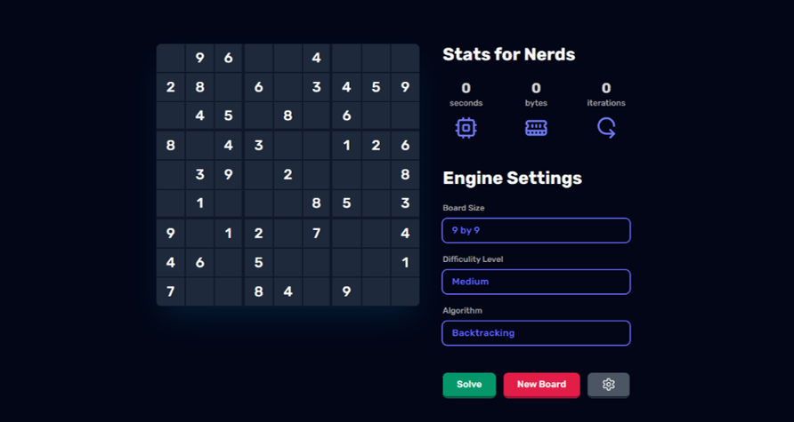

# Sudoku Solver Documentation

This is a Sudoku solver for puzzles of various sizes that utilizes backtracking and genetic algorithms. It is implemented in Python and built using Electron JS.

#### Last Updated: June 1st, 2024
## Table of Contents

1. [Introduction](#introduction)
2. [Features](#features)
3. [Installation](#installation)
4. [Usage](#usage)
5. [Acknowledgement](#acknowledgements)

<a name="introduction"></a>
## Introduction 
Sudoku is a popular logic puzzle that requires filling a 9x9 grid with digits 1-9 such that each row, column, and 3x3 sub-grid contains all the digits without repetition. This project creates a user-friendly application that utilizes two algorithms, backtracking and genetic algorithm, to solve Sudoku puzzles of varying difficulties while educating users on the solving process.

<a name="features"></a>
## Features 
- Sudoku Board Sizes: Our app supports solving Sudoku puzzles of various sizes: 9x9, 6x6, and 4x4.
- Solving Algorithms: The solver utilizes two main algorithms: backtracking and genetic algorithms.
- Insights: Users can gain insights into the solving process, including solving time, memory usage, and iterations taken for each algorithm.
- Testing: We provide a testing feature where users can evaluate the solver's performance by running it against a dataset containing 500 random Sudoku boards with their solutions, sourced from a larger collection of - 10,000 puzzles stored in a CSV format.

<a name="installation"></a>
## Installation

Make sure you have [python](https://www.python.org/downloads/) downloaded if you haven't already.
Follow these steps to set up the environment and run the application:

1. Clone the Repository:
   
```bash
git clone https://github.com/Sambonic/sudoku-solver
```

```bash
cd sudoku-solver
```

2. Create a Python Virtual Environment:
```bash
python -m venv env
```

3. Activate the Virtual Environment:
- On Windows:
  ```
  env\Scripts\activate
  ```

- On macOS and Linux:
  ```
  source env/bin/activate
  ```
4. Ensure Pip is Up-to-Date:
  ```
  python.exe -m pip install --upgrade pip
  ```
5. Navigate to the Client Directory:
  ```bash
  cd sudoku/client
  ```

6. Install Dependencies
  ```bash
  npm i
  ```


<a name="usage"></a>
## Usage


0. Start the application by running `npm start` in the terminal
1. Launch the application.
2. Select the size of the Sudoku board you want to solve (9x9, 6x6, or 4x4).
3. Input the initial numbers into the grid or click "New Board" to generate a random board.
4. Choose the solving algorithm (backtracking or genetic).
5. Click the "Solve" button to initiate the solving process.
6. View insights such as solving time, memory usage, and iterations taken.
7. Optionally, run the testing feature to evaluate the solver's performance.

<a name="acknowledgements"></a>
## Acknowledgement

This was a group work that involved: Amir Moahmed, Amr Magdy, and myself. Special thanks to TA Farah for her support, encouragement and motivation role throughout the development of this project.
